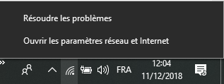
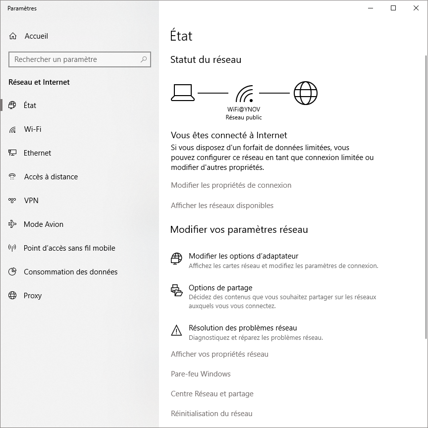
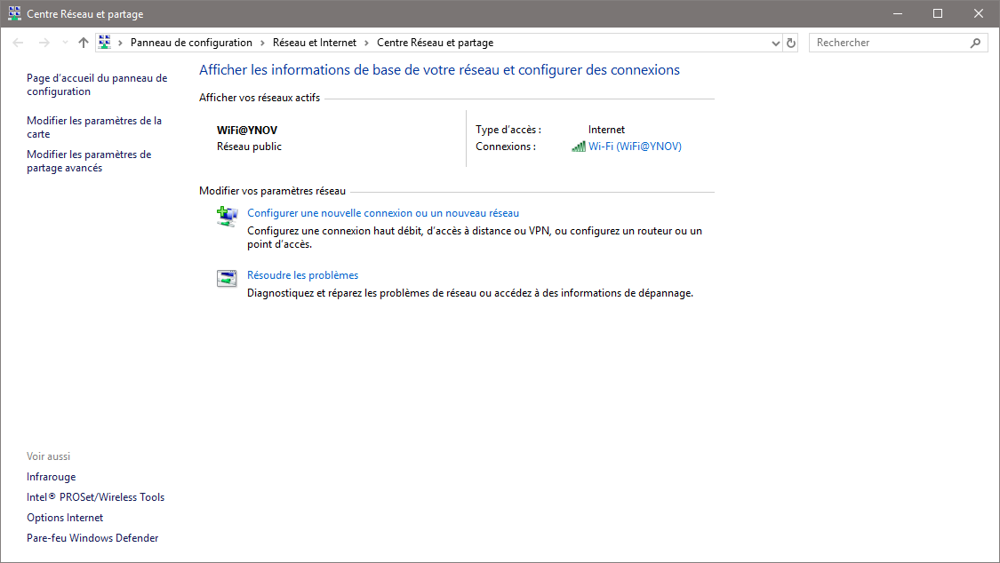
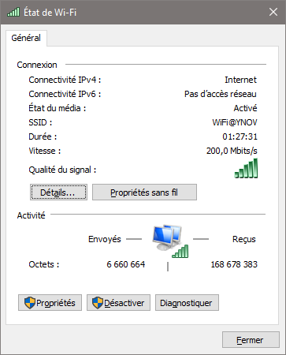
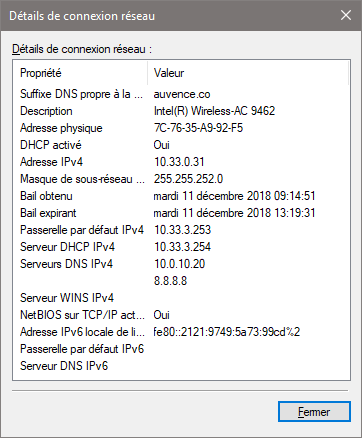
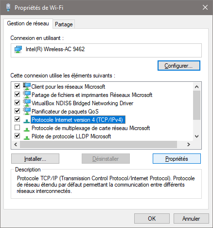
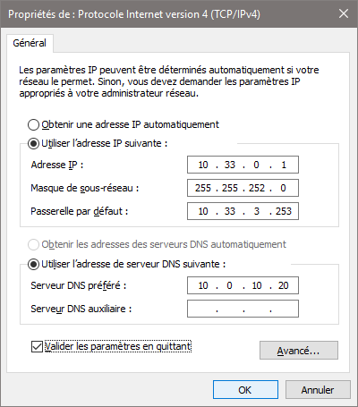
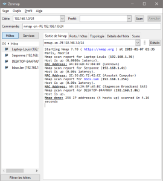
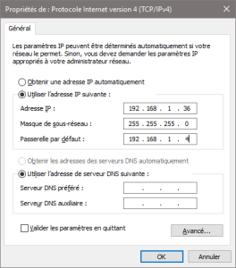
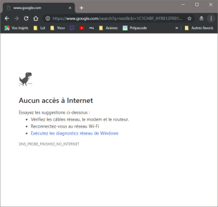

*Marc BERNARD ; B1B*
#  **TP2** - Réseau 

***Table des matières***	
 - 
 - Exploration locale en solo
	 - 
	 - Affichage d'information sur la pile TCP/IP locale
		 - en ligne de commande
		 - En graphique (GUI : Graphical User Interface)
	-Modification des informations 

## Exploration Locale en solo

### Affichage d’information sur la pile TCP/IP locale

#### En ligne de commande

Pour voir ces informations, il faut ouvrir Windows PowerShell (dans mon cas car je suis sous windows).

Une fois l’interface ouverte, il suffit d’utiliser la commande « ipconfig /all » pour afficher les informations que l’on cherche. On obtient donc :

| | Interface WiFi | Interface Ethernet | 
|--|--|--| 
| Nom |Intel(R) Wireless-AC 9462 | Realtek PCIe GBE Family Controller |
| Adresse Mac | 7C-76-35-A9-92-F5 | 30-9C-23-91-CB-53 |
 IP | 10.33.0.31| X |
 Masque sousréseau | <![endif]--> 255.255.252.0 (/22) | X | 
 Adresse Réseau | 10.33.0.0/22 | X|
 Adresse Broadcast | 10.33.3.254/22 | X | 
 Adresse Passerelle | 10.33.3.253/22 | X

Pour l’interface Ethernet, l’adresse MAC et la seule information que l’on peut avoir car la carte Ethernet n’est pas connectée.

#### En graphique (GUI : Graphical User Interface)
Pour commencer faites un clique droit sur l'icône du Wi-Fi en bas à droite de votre barre tes tâches.
Vous obtenez normalement cela:

Sélectionnez ensuite "Ouvrir les paramètres réseau et Internet".
La fenêtre ci dessous est à présent ouverte :

Sélectionnez "Centre Réseau et partage", cette fenêtre apparaît ensuite:

Sélectionnez ensuite votre réseau Wi-fi, dans mon cas ce sera le Wi-fi d'Ynov.
Vous obtiendrez cela :

Choisissez ensuite le bouton "Détails..." pour avoir enfin la fenêtre avec les informations, ce qui donne :

Une Gateway est l'adresse IP par laquelle un hôte doit passer pour pouvoir communiquer avec un réseau extérieur.

#### Modification des informations

Pour changer votre IP ;
Comme montré précédemment il vous faut revenir à cette fenêtre et sélectionnez "Propriétés":

Ensuite il faut choisir " Protocole Internet version 4(TCP/IPv4)" puis prenez à nouveau "Propriétés":

Arrivé ici cocher la case «Utiliser l’adresse IP suivante : » puis vous avez ensuite à entrer l’IP souhaité qui correspondra à la nouvelle adresse d’hôte que vous aurez dans le réseau, par exemple ici on prend la première adresse d’hôte possible dans ce réseau. La dernière étant 10.33.0.252 car celle après est prise par la passerelle par défaut.

# Nmap

### Modification d'adresse IP avec Nmap

Avec l'outil Nmap j'utilise la commande : 

    nmap -sn -PE 192.168.1.0/24

Donc 192.168.1.0/24 est l'adresse du réseau sur lequel je suis.

  

On peut voir sur la capture d'écran mon ordinateur : "Serponne", mon adresse IP est 192.168.1.41, sur le réseau il y a aussi d'autre d'autre hôtes comme par exemple "Laptop-Louis" qui a pour adresse IP : 192.168.1.36/24
Mon adresse Gateway actuelle est 192.168.1.254/24 et je vais la changer par une autre.
Par exemple 192.168.1.4/24
Ce qui donne:

On essaye ensuite d'effectuer une recherche sur un navigateur:

On peut voir que je reste connecté au réseau mais je n'ai pas accès à internet .
# Exploration en duo
## Création de réseau

J'ai donc changé mon adresse IP pour 145.1.14.1/24.
Je me suis ensuite connecté à l'ordinateur de mon camarade à l'aide d'un câble ethernet.
Son adresse IP dans le réseau était 145.1.14.5/24.
J'effectue maintenant un ping vers l'ordinateur connecté avec le mien.

On peut voir que le ping fonctionne, les ordinateurs sont bien connectés en réseau.
<!--stackedit_data:
eyJoaXN0b3J5IjpbMTk1MjU5NjQwNywtMTYzOTcwNDgxMCwtMj
E0NjQ4NzMxNywxNDY4NDkxMzQxLDExNjE0OTMxNSwtMjYwNDYw
MzU4LC0xMzgxNzMzNzcsLTgzNTc5MzcxOSwtMTM5MzM2Mzc4MS
wtMTU2OTgyMTM0NCw2MDU5NTQ2MjIsOTQ0OTEzMDgxXX0=
-->